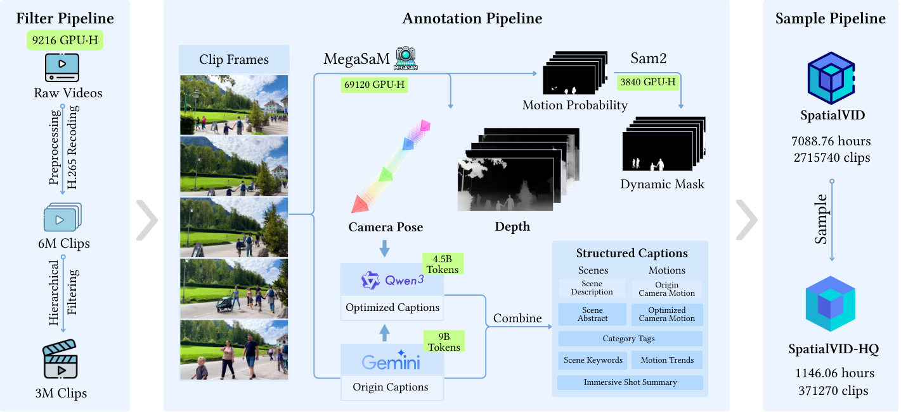

<h1 align='center'>SpatialVID: A Large-Scale Video Dataset with Spatial Annotations</h1>
<div align='center'>
    <a href='https://oiiiwjh.github.io/' target='_blank'>Jiahao Wang</a><sup>1*</sup> 
    <a href='https://github.com/FelixYuan-YF' target='_blank'>Yufeng Yuan</a><sup>1*</sup> 
    <a href='https://github.com/zrj-cn' target='_blank'>Rujie Zheng</a><sup>1*</sup> 
    <a href='https://linyou.github.io' target='_blank'>Youtian Lin</a><sup>1</sup> 
    <a href='https://github.com/YeeZ93' target='_blank'>Yi Zhang</a><sup>1</sup> 
    <a href='https://openreview.net/profile?id=~yajie_bao5' target='_blank'>Yajie Bao</a><sup>1</sup> 
    <a href='https://linzhuo.xyz' target='_blank'>Lin-Zhuo Chen</a><sup>1</sup> 
</div>
<div align='center'>
    <a href='https://github.com/yxzhou217' target='_blank'>Yanxi Zhou</a><sup>1</sup> 
    <a href='https://www.xxlong.site/index.html' target='_blank'>Xiaoxiao Long</a><sup>1</sup> 
    <a href='http://zhuhao.cc/home/' target='_blank'>Hao Zhu</a><sup>1</sup> 
    <a href='http://zhaoxiangzhang.net/' target='_blank'>Zhaoxiang Zhang</a><sup>2</sup> 
    <a href='https://cite.nju.edu.cn' target='_blank'>Xun Cao</a><sup>1</sup> 
    <a href='https://yoyo000.github.io/' target='_blank'>Yao Yao</a><sup>1†</sup>
</div>
<div align='center'>
    <sup>1</sup>Nanjing University  <sup>2</sup>Institute of Automation, Chinese Academy of Science 
</div>
<br>
<div align="center">
  <a href="https://nju-3dv.github.io/projects/SpatialVID/"></a>  
  <a href="#"></a>  
  <a href="https://github.com/NJU-3DV/SpatialVID"></a>  
  <a href="https://huggingface.co/SpatialVID"></a>  
</div>
<p align="center">
  
</p>

## Abstract

Significant progress has been made in spatial intelligence, spanning both spatial reconstruction and world exploration. However, the scalability and real-world fidelity of current models remain severely constrained by the scarcity of large-scale, high-quality training data. While several datasets provide camera pose information, they are typically limited in scale, diversity, and annotation richness, particularly for dynamic scenes with realistic camera motion. To address this gap, we collect a large corpus of raw video with natural camera movement, providing the foundation for constructing a dataset with unique scale and diversity. In this work, we introduce **SpatialVID**, a large-scale dynamic spatial dataset explicitly designed to provide expressive annotations for this purpose. Through a hierarchical filtering pipeline, we process more than **21,000 hours** of collected raw video into **2.7 million clips**, totaling **7,089 hours** of dynamic content. A subsequent annotation pipeline enriches these clips with detailed spatial and semantic information, including camera poses, depth maps, dynamic masks, structured captions, and labels for camera motion and scene composition.

## 🎉NEWS

+ [2025.09.08] 🔥 Our paper, code and SpatialVid-HQ dataset are released!

## Preparation

### Environment

1. Necessary packages

   ```bash
   git clone --recursive https://github.com/NJU-3DV/SpatialVID.git
   cd SpatialVid
   conda create -n SpatialVID python=3.10.13
   conda activate SpatialVID
   pip install -r requirements/requirements.txt
   ```
2. Package needed for scoring

   ```bash
   pip install paddlepaddle-gpu==3.0.0 -i https://www.paddlepaddle.org.cn/packages/stable/cu126/
   pip install -r requirements/requirements_scoring.txt
   ```

   Ignore the warning about `nvidia-nccl-cu12` and `numpy` version, it is not a problem.

   About FFMPEG, please refer to the [FFMPEG with NVIDIA GPU](https://docs.nvidia.com/video-technologies/video-codec-sdk/11.1/ffmpeg-with-nvidia-gpu/index.html#compiling-ffmpeg) for CUDA acceleration and [VMAF](https://github.com/Netflix/vmaf) for VMAF support.

   Replace the `FFMPEG_PATH` variable in the [`scoring/motion/inference.py`](scoring/motion/inference.py) and [`utils/cut.py`](utils/cut.py) with the actual path to your ffmpeg executable, default is `/usr/local/bin/ffmpeg`.

   [Optional] if your videos are in av1 codec instead of h264, you need to install ffmpeg (already in our requirement script), then run the following to make conda support av1 codec:

   ```bash
   pip uninstall opencv-python
   conda install -c conda-forge opencv
   ```
3. Package needed for annotation

   ```bash
   pip install -r requirements/requirements_annotation.txt
   ```

   Compile the extensions for the camera tracking module:

   ```bash
   cd camera_pose_annotation/base
   python setup.py install
   ```

### Model Weight

Download the model weights used in our experiments:

```bash
bash scripts/download_checkpoints.sh
```

Or you can manually download the model weights from the following links and place them in the appropriate directories.

| Model               | File Name               | URL                                                                                                             |
| ------------------- | ----------------------- | --------------------------------------------------------------------------------------------------------------- |
| Aesthetic Predictor | aesthetic               | [🔗](https://github.com/christophschuhmann/improved-aesthetic-predictor/raw/main/sac+logos+ava1-l14-linearMSE.pth) |
| MegaSAM             | megasam_final           | [🔗](https://github.com/mega-sam/mega-sam/blob/main/checkpoints/megasam_final.pth)                                 |
| RAFT                | raft-things             | [🔗](https://drive.google.com/uc?id=1MqDajR89k-xLV0HIrmJ0k-n8ZpG6_suM)                                             |
| Depth Anything      | Depth-Anything-V2-Large | [🔗](https://huggingface.co/depth-anything/Depth-Anything-V2-Large)                                                |
| UniDepth            | unidepth-v2-vitl14      | [🔗](https://huggingface.co/lpiccinelli/unidepth-v2-vitl14)                                                        |
| SAM                 | sam2.1-hiera-large      | [🔗](https://huggingface.co/facebook/sam2.1-hiera-large)                                                           |

## Quick Start

The whole pipeline is illustrated in the figure below:

<p align="center">
  
</p>

1. Scoring

   ```bash
   bash scripts/scoring.sh
   ```

   Inside the [`scoring.sh`](scripts/scoring.sh) script, you need to set the following variables:

   - `ROOT_VIDEO` is the directory containing the input video files.
   - `OUTPUT_DIR` is the directory where the output files will be saved.
2. Annotation

   ```bash
   bash scripts/annotation.sh
   ```

   Inside the [`annotation.sh`](scripts/annotation.sh) script, you need to set the following variables:

   - `CSV` is the CSV file generated by the scoring script, default is `$OUTPUT_DIR/results.csv`.
   - `OUTPUT_DIR` is the directory where the output files will be saved.
3. Caption

   ```bash
   bash scripts/caption.sh
   ```

   Inside the [`caption.sh`](scripts/caption.sh) script, you need to set the following variables:

   - `CSV` is the CSV file generated by the annotation script, default is `$OUTPUT_DIR/results.csv`.
   - `SRC_DIR` is the annotation output directory, default is the same as the `OUTPUT_DIR` in the annotation step.
   - `OUTPUT_DIR` is the directory where the output files will be saved.
   - The API keys for the LLM models used in the captioning step. You can replace them with your own API keys.

## Dataset Download

Apart from downloading the dataset using terminal commands, we provide scripts to download the SpatialVID/SpatialVID-HQ dataset from HuggingFace. Please refer to the [`download_SpatialVID.py`](utils/download_SpatialVID.py) script for more details.

We also provide our script to download the raw videos from YouTube. You can refer to the [`download_raw_videos.py`](utils/download_raw_videos.py) script for more details.

## References

Thanks to the developers and contributors of the following open-source repositories, whose invaluable work has greatly inspire our project:

- [Open-Sora](https://github.com/hpcaitech/Open-Sora): An initiative dedicated to efficiently producing high-quality video.
- [MegaSaM](https://github.com/mega-sam/mega-sam): An accurate, fast and robust casual structure and motion from casual dynamic videos.
- [Depth Anything V2](https://github.com/DepthAnything/Depth-Anything-V2): A model for monocular depth estimation.
- [UniDepthV2](https://github.com/lpiccinelli-eth/UniDepth): A model for universal monocular metric depth estimation.
- [SAM2](https://github.com/facebookresearch/sam2): A model towards solving promptable visual segmentation in images and videos.
- [Viser](https://viser.studio/latest/): A library for interactive 3D visualization in Python.

This project is licensed under Apache License. However, if you use MegaSaM or other components in your work, please follow their license.

## Citation

```bibtex

```
