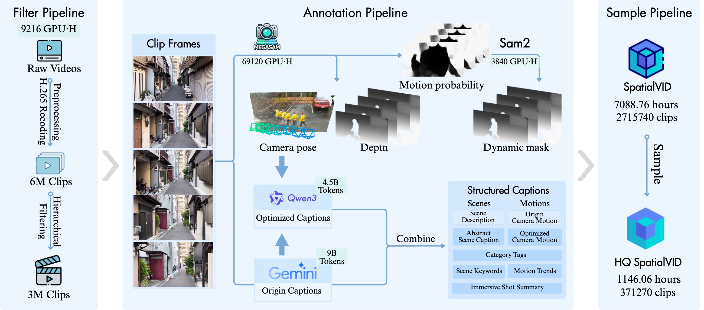

<h1 align='center'>SpatialVid: A Large Scale Video Dataset with 3D Annotation</h1>
<div align='center'>
    <a href='https://github.com/crystallee-ai' target='_blank'>Hui Li</a><sup>1*</sup> 
    <a href='https://github.com/xumingw' target='_blank'>Mingwang Xu</a><sup>1*</sup> 
    <a href='https://github.com/subazinga' target='_blank'>Yun Zhan</a><sup>1</sup> 
    <a href='https://github.com/AricGamma' target='_blank'>Shan Mu</a><sup>1</sup> 
    <a href='https://github.com/Studentxll' target='_blank'>Jiaye Li</a><sup>1</sup> 
    <a href='https://github.com/Kaihui-Cheng' target='_blank'>Kaihui Cheng</a><sup>1</sup> 
    <a href='https://github.com/Shr1ke777' target='_blank'>Yuxuan Chen</a><sup>1</sup> 
    <a href='https://github.com/tchen0623' target='_blank'>Tan Chen</a><sup>1</sup> 
</div>
<div align='center'>
    <a href='#' target='_blank'>Mao Ye</a><sup>3</sup> 
    <a href='https://jingdongwang2017.github.io/' target='_blank'>Jingdong Wang</a><sup>2</sup> 
    <a href='https://sites.google.com/site/zhusiyucs/home' target='_blank'>Siyu Zhu</a><sup>1</sup> 
</div>
<div align='center'>
    <sup>1</sup>Fudan University  <sup>2</sup>Baidu Inc  <sup>3</sup>Shanghai Jiaotong University
</div>
<br>
<div align="center">
  <a href="https://nju-pcalab.github.io/projects/openvid/"></a>  
  <a href="https://arxiv.org/abs/2407.02371"></a>  
  <a href="https://huggingface.co/SpatialVid"></a>  
</div>
<p align="center">
  
</p>

## Introduction

SpatialVid is a large-scale and high-quality video dataset designed for

## Preparation

### Environment

1. Necessary packages

   ```bash
   git clone --recursive https://github.com/opencam-vid/SpatialVid.git
   cd SpatialVid
   conda create -n SpatialVid python=3.10.13
   conda activate SpatialVid
   pip install -r requirements/requirements.txt
   ```
2. Package needed for scoring

   ```bash
   pip install paddlepaddle-gpu==3.0.0 -i https://www.paddlepaddle.org.cn/packages/stable/cu126/
   pip install -r requirements/requirements_scoring.txt
   ```

   Ignore the warning about `nvidia-nccl-cu12` version, it is not a problem.

   About FFMPEG ？

   Replace the `FFMPEG_PATH` variable in the [`scoring/motion/inference.py`](scoring/motion/inference.py) and [`utils/cut.py`](utils/cut.py) with the actual path to your ffmpeg executable, default is `/usr/local/bin/ffmpeg`.

   [Optional] if your videos are in av1 codec instead of h264, you need to install ffmpeg (already in our requirement script), then run the following to make conda support av1 codec:

   ```bash
   pip uninstall opencv-python
   conda install -c conda-forge opencv
   ```
3. Package needed for annotation

   ```bash
   pip install -r requirements/requirements_annotation.txt
   ```

   Compile the extensions for the camera tracking module:

   ```bash
   cd camera_pose_annotation/base
   python setup.py install
   ```

4. Package needed for caption

   ```bash
   pip install -r requirements/requirements_caption.txt
   ```

### Model Weight

Download the model weights used in our experiments:

```bash
bash scripts/download_checkpoints.sh
```

Or you can manually download the model weights from the following links and place them in the appropriate directories.

| Model          | File Name               | URL                                                                 |
| -------------- | ----------------------- | ------------------------------------------------------------------- |
| RAFT           | raft-things             | [🔗](https://drive.google.com/uc?id=1MqDajR89k-xLV0HIrmJ0k-n8ZpG6_suM) |
| Depth Anything | Depth-Anything-V2-Large | [🔗](https://huggingface.co/depth-anything/Depth-Anything-V2-Large)    |
| UniDepth       | unidepth-v2-vitl14      | [🔗](https://huggingface.co/lpiccinelli/unidepth-v2-vitl14)            |
| SAM            | sam2.1-hiera-large      | [🔗](https://huggingface.co/facebook/sam2.1-hiera-large)                     |

## Inference
The whole pipeline is illustrated in the figure below:

<p align="center">
  
</p>

1. Scoring

   ```bash
   bash scripts/scoring.sh
   ```

   Inside the [`scoring.sh`](scripts/scoring.sh) script, you need to set the following variables:

   - `ROOT_VIDEO` is the directory containing the input video files.
   - `OUTPUT_DIR` is the directory where the output files will be saved.
2. Annotation

   ```bash
   bash scripts/annotation.sh
   ```

   Inside the [`annotation.sh`](scripts/annotation.sh) script, you need to set the following variables:

   - `CSV` is the CSV file generated by the scoring script, default is `$OUTPUT_DIR/meta/clips_scores.csv`.
   - `OUTPUT_DIR` is the directory where the output files will be saved.

3. Caption

   ```bash
   bash scripts/caption.sh
   ```

## References

Part of the code is based upon: [Open-Sora](https://github.com/hpcaitech/Open-Sora). Thanks for their great work!

## Citation

```bibtex

```
