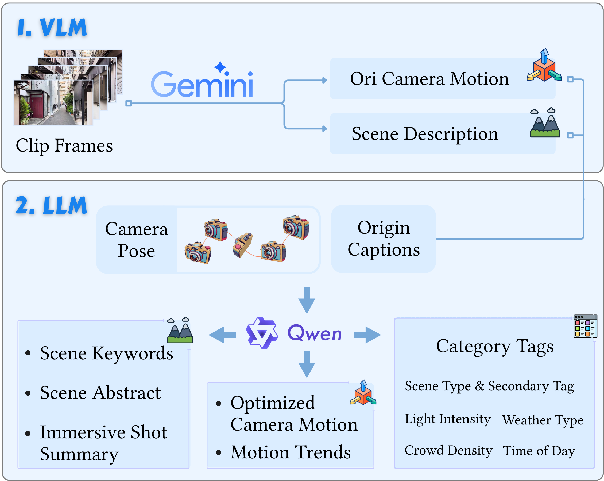

# Semantic Information Annotation

This script automates the process of generating structured text descriptions (captions) for videos through a multi-step pipeline involving Visual Question Answering (VQA), Large Language Models (LLM), result combination, and tagging.

## Captioning Workflow

The video captioning process follows these sequential steps:

1. **VQA Captioning**: Uses a Visual Question Answering model to analyze visual content and generate initial captions based on predefined prompts.
2. **LLM Captioning**: Employs a Large Language Model to process pose data and generate additional descriptive captions.
3. **Result Combination**: Merges the outputs from the VQA and LLM steps into a unified structure.
4. **Tag Addition**: Enhances the combined results with relevant tags using a language model.

  

## Script Explanation

### Configuration Parameters

- `CSV`: Path to the result CSV file generated in the annotation step
- `SRC_DIR`: Path to the annotation output directory containing video frames and pose data
- `OUTPUT_DIR`: Path where all output files will be saved
- `num_workers`: Number of parallel workers to use for processing
- `wait_time`: Waiting time between API requests (in seconds)

### Step 1: VQA Captioning

Generates captions by analyzing visual content using a VQA model.

Parameters:
- `--csv_path`: Path to the input CSV file
- `--fig_load_dir`: Directory containing video frames/images
- `--output_dir`: Directory to save VQA results
- `--prompt_file`: Path to VQA prompt template file
- `--model`: VQA model to use (default: gemini-2.0-flash)
- `--api_key`: API key for accessing the VQA model service
- `--base_domain`: API endpoint domain for the VQA model
- `--num_workers`: Number of parallel workers
- `--wait_time`: Waiting time between API requests

### Step 2: LLM Captioning

Generates additional captions by processing pose data using a Large Language Model.

Parameters:
- `--csv_path`: Path to the input CSV file
- `--pose_load_dir`: Directory containing pose data
- `--output_dir`: Directory to save LLM results
- `--prompt_dir`: Directory containing LLM prompt templates
- `--model`: LLM model to use (default: qwen3-30b-a3b)
- `--api_key`: API key for accessing the LLM service
- `--base_domain`: API endpoint domain for the LLM
- `--num_workers`: Number of parallel workers
- `--wait_time`: Waiting time between API requests

### Step 3: Combine Results

Merges the outputs from VQA and LLM steps into a unified format.

Parameters:
- `--csv_path`: Path to the input CSV file
- `--load_dir`: Directory containing VQA and LLM results
- `--output_dir`: Directory to save combined results
- `--num_workers`: Number of parallel workers

### Step 4: Add Tags

Enhances the combined results with relevant tags using a language model.

Parameters:
- `--csv_path`: Path to the input CSV file
- `--json_load_dir`: Directory containing combined results
- `--prompt_file`: Path to tagging prompt template file
- `--model`: Model to use for tagging (default: qwen3-30b-a3b)
- `--api_key`: API key for accessing the tagging model service
- `--base_domain`: API endpoint domain for the tagging model
- `--num_workers`: Number of parallel workers
- `--wait_time`: Waiting time between API requests

## Usage

1. Replace all placeholder values (enclosed in square brackets) with your actual paths and API keys
2. Make the script executable: `chmod +x caption_pipeline.sh`
3. Run the script: `./caption_pipeline.sh`

The script will execute each step sequentially, displaying start/end times and duration for each step, and save all outputs to the specified `OUTPUT_DIR`.

## results example
several samples of video captions generated by the model after each step.